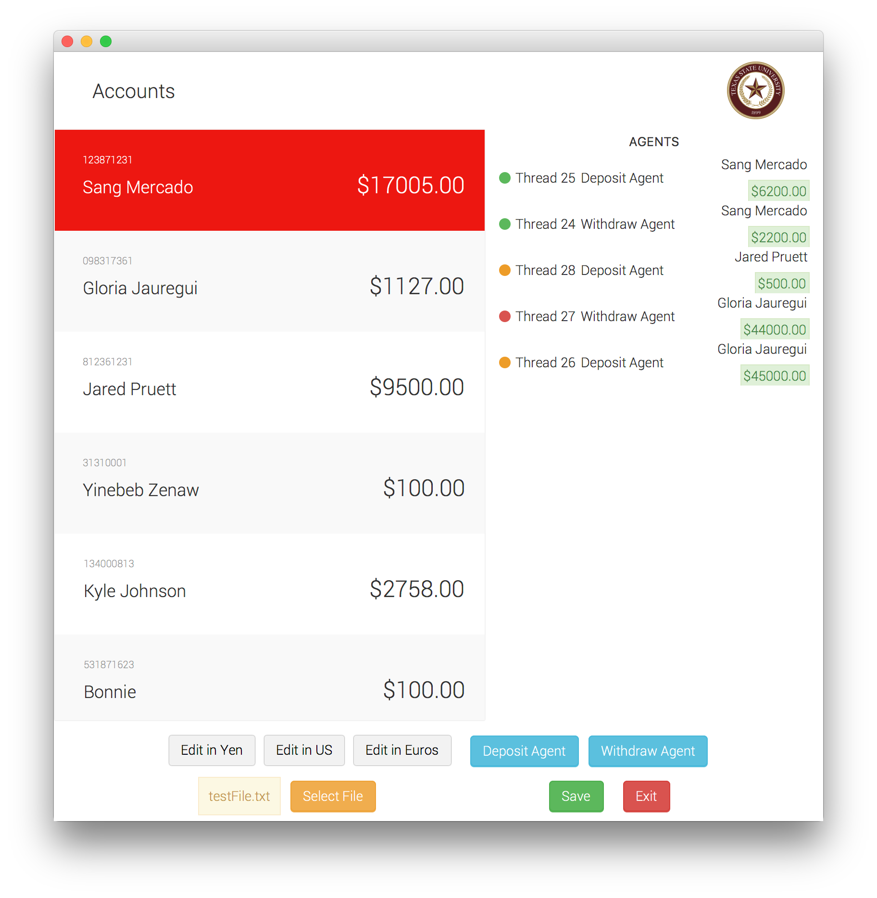

##### Develop a software system for simple account management using “push” Model View Controller architecture (i.e. a view receives updates from a model by events), exception mechanism and JUnit framework in Java with Swing.

`Used model-view-controller pattern with JavaFX`

## UML Diagram

## Textual Description of Data Structures in Model package

### Agent
Agent acts as a base class for both deposit agent and withdraw agent. It implements runnable and gets executed by AgentThreadMonitor/AgentThreadExecutor

### Account
Account acts a model for the entire program. Any time the properties of this class change, all the controllers get an event.

### ConcurrentAccount
Account class with withdraw/deposit being thread safe.

### AccountModel
This is the class that all controllers have as a "singleton model". It is responsibile for returning current account and setting a list of accounts for controllers.

## UI Related
##### On start up the system should load a list of accounts from a file specified in a command line and present the user with a frame that contains
+ a drop down list populated with account IDs with names appended (in increasing order of IDs); the first account ID should be pre-selected; the items in the drop-down list immutable
+ buttons “Edit account in $”; “Edit account in Euros”; “Edit account in Yen”
+ button Save
+ button Exit

##### On pressing one of the buttons “Edit account in ..” the system should open another window that contains:
+ window’s title <NameOfAccountHolder ID; Operations in {$ or Euros or Yen}>
+ immutable textfield that shows the current amount in the account titled + “Available funds” (i.e. Available funds: <textfield>)
+ editable textfield initialized to 0.0 that only allows digits and decimal point to be entered; titled “Enter amount in {$ or Euros or Yen}”
+ buttons “Deposit”, ‘Withdraw”, “Dismiss”

##### On pressing “Withdraw” if the editable textfield contains a positive number greater than 1 and there are sufficient funds then that amount is subtracted from the account amount; the result of the operation must be seen in all other windows open for this account with appropriate exchange rate modifications. If funds are insufficient then an exception must be raised by some method from a class in the model package that will eventually is caught by the controller and the controller must request the view to open a pop-up window that contains message “Insufficient funds: amount to withdraw is x, it is greater than available funds: y”. The pop-up window contains button “Dismiss” on pressing which the pop-up window should close.

##### The system should have other exceptions as needed (e.g. in response to corrupted or inconsistent content of the file with accounts; e.g. inadmissible characters in the fields of an account entry; broken format of the file). Exceptions should result in useful messages via dismissable pop-up windows. In case of file inconsistencies messages should mention name of the file, line number where inconsistency occurred, nature of inconsistency, suggestion to fix (e.g. “Name must have only letters” or “Amount must not be negative”). If an error is unrecoverable the system should exit on dismissing the pop up window.

##### A “Start ... agent ...” window should contain:
+ Editable textfield “Agent ID”
+ Editable textfield “Amount in $”
+ Editable textfield “Operations per second” initialized to 0.0, it accepts only digits and a decimal point
+ Button “Start agent”
+ Button “Dismiss”

##### If the button “Start agent” is pressed while the input is insufficient or improper, an informative dismissable pop-up window should appear. The “Start ... agent ...” window should stay on.

##### A “<Deposit/Withdraw> agent <agentID> for account <accountID>” window should contain:
+ Immutable textfields “Amount in $” and “Operations per second” with the proper info
+ Uneditable textfield “State” (proper values: Running, Blocked, Stopped)
+ Uneditable textfield “Amount in $ transferred” that reflects the amount transferred
by this agent (either deposited or withdrawn”
+ Uneditable textfield “Operations completed” with a proper count
+ Button “Stop agent”
+ Button “Dismiss agent”



##### Button “Dismiss agent” should be grayed out before button “Stop agent” is pressed.On pressing button “Stop agent” the agent should be stopped with the window staying on. The “State” textfield should show “Stopped”.

##### If button “Dismiss agent” is pressed after button “Stop agent” has been pressed then this window should close. A withdraw agent should block if the amount in the account would become negative as a result of the agent’s next operation. A “Withdraw agent <agentID> for account <accountID>” window should show “Blocked” in its “State” textfield.

